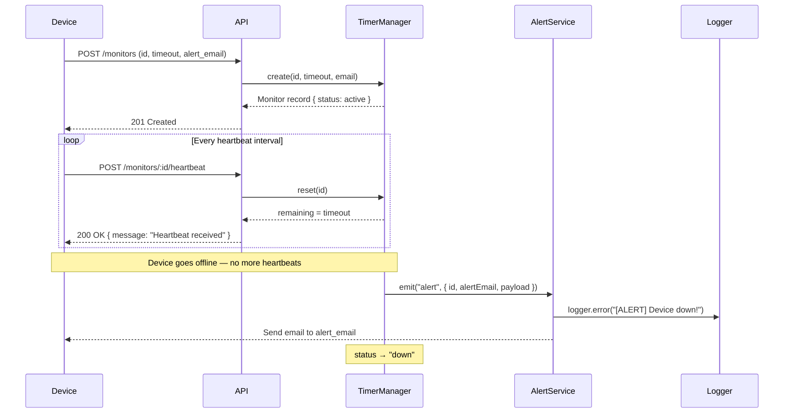
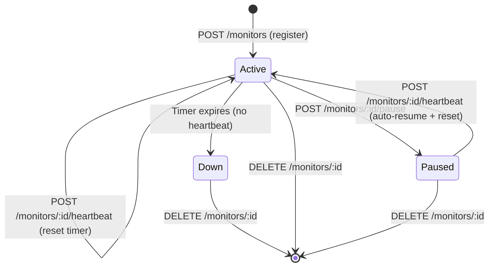

# 🛰️ Pulse-Check API — Watchdog Sentinel

> **Production-grade Dead Man's Switch API for CritMon Servers Inc.**
>
> Monitors remote solar farms and unmanned weather stations. Automatically detects missed heartbeats and triggers alerts before a human ever has to check a log.

---

## 📋 Table of Contents

1. [Project Overview](#-project-overview)
2. [Features](#-features)
3. [Architecture Diagram](#-architecture-diagram)
4. [State Flow Diagram](#-state-flow-diagram)
5. [Setup & Installation](#-setup--installation)
6. [Environment Variables](#-environment-variables)
7. [Running the Server](#-running-the-server)
8. [API Documentation](#-api-documentation)
9. [Example Requests & Responses](#-example-requests--responses)
10. [Developer's Choice Feature](#-developers-choice-feature)
11. [Testing](#-testing)
12. [Project Structure](#-project-structure)
13. [Future Improvements](#-future-improvements)

---

## 🔍 Project Overview

CritMon Servers Inc. monitors remote infrastructure — solar farms, weather stations — in areas with poor connectivity. Devices are expected to send periodic **"I'm alive"** heartbeats.

**The problem:** there was no automatic way to detect when a device stopped communicating.

**The solution:** Pulse-Check API — a stateful backend service that:

- Registers devices and starts countdown timers
- Resets timers when heartbeats arrive
- Automatically fires alerts when timers expire
- Supports maintenance pauses to prevent false alarms
- Provides a live dashboard for support engineers

---

## ✨ Features

| Feature | Description |
|---|---|
| **Monitor Registration** | Register any device with a custom timeout duration |
| **Heartbeat Reset** | Reset the countdown with a single HTTP request |
| **Automatic Alert** | FireS a console & email alert when a device goes silent |
| **Pause / Maintenance Mode** | Freeze the countdown during planned downtime |
| **Auto-Resume on Heartbeat** | A heartbeat un-pauses a monitor automatically |
| **Monitoring Dashboard** | `GET /monitors` — live view of all device states |
| **Single Monitor View** | `GET /monitors/:id` — inspect any individual device |
| **Delete Monitor** | Remove a device and clean up its timer |
| **Health Check** | `GET /health` — server status + aggregate stats |
| **Email Alerts** | Developer's Choice — email dispatch via nodemailer |
| **Swagger UI** | Interactive API docs at `/api-docs` |
| **Request Logging** | Every HTTP call logged with method, path, status, and latency |
| **Structured Logging** | Winston logs to `logs/combined.log` and `logs/error.log` |

---

## 🏗️ Architecture Diagram

The sequence below shows the full lifecycle of a monitored device — from registration through heartbeats to an alert.



---

## 🔄 State Flow Diagram

A monitor can exist in exactly one of three states:



> **Note:** A `Down` monitor cannot be reactivated directly — it must be deleted and re-registered. This matches a real Dead Man's Switch where an expired alert requires deliberate human acknowledgement.

---

## ⚙️ Setup & Installation

### Prerequisites

- [Node.js](https://nodejs.org/) v18 or later
- npm v9 or later

### Clone & Install

```bash
# 1. Clone the repository
git clone https://github.com/YOUR_USERNAME/pulse-check-api.git
cd pulse-check-api

# 2. Install dependencies
npm install

# 3. Copy environment template
cp .env.example .env
```

---

## 🔐 Environment Variables

Edit `.env` before starting the server:

| Variable | Default | Description |
|---|---|---|
| `PORT` | `3000` | HTTP server port |
| `NODE_ENV` | `development` | `development` / `production` / `test` |
| `CORS_ORIGIN` | `*` | Allowed CORS origin |
| `EMAIL_HOST` | _(empty)_ | SMTP server hostname |
| `EMAIL_PORT` | `587` | SMTP port |
| `EMAIL_SECURE` | `false` | Use TLS (`true`/`false`) |
| `EMAIL_USER` | _(empty)_ | SMTP username |
| `EMAIL_PASS` | _(empty)_ | SMTP password / app password |
| `EMAIL_FROM` | see example | Sender display name and address |

> **Note:** Email settings are optional. If not configured, alerts are logged to the console and `logs/error.log` only.

---

## 🚀 Running the Server

```bash
# Production
npm start

# Development (auto-restart with nodemon)
npm run dev
```

Server output:

```
🚀 Pulse-Check API (Watchdog Sentinel) running on port 3000
📖 Swagger docs available at http://localhost:3000/api-docs
❤️  Health check: http://localhost:3000/health
```

---

## 📖 API Documentation

Interactive Swagger UI is available at **`http://localhost:3000/api-docs`** when the server is running.

### Endpoint Summary

| Method | Endpoint | Description |
|---|---|---|
| `GET` | `/health` | Server health + monitor stats |
| `POST` | `/monitors` | Register a new monitor |
| `GET` | `/monitors` | Dashboard — list all monitors |
| `GET` | `/monitors/:id` | Get a single monitor |
| `POST` | `/monitors/:id/heartbeat` | Send heartbeat / reset timer |
| `POST` | `/monitors/:id/pause` | Pause monitoring (maintenance) |
| `DELETE` | `/monitors/:id` | Remove a monitor |

### Status Codes

| Code | Meaning |
|---|---|
| `200` | Success |
| `201` | Monitor created |
| `400` | Validation error |
| `404` | Monitor not found |
| `409` | Conflict (duplicate ID / already paused) |
| `500` | Internal server error |

---

## 💡 Example Requests & Responses

### Register a Monitor

```bash
curl -X POST http://localhost:3000/monitors \
  -H "Content-Type: application/json" \
  -d '{"id": "device-123", "timeout": 60, "alert_email": "admin@critmon.com"}'
```

```json
{
  "success": true,
  "message": "Monitor created successfully",
  "id": "device-123"
}
```

### Send a Heartbeat

```bash
curl -X POST http://localhost:3000/monitors/device-123/heartbeat
```

```json
{
  "success": true,
  "message": "Heartbeat received"
}
```

### Pause Monitoring

```bash
curl -X POST http://localhost:3000/monitors/device-123/pause
```

```json
{
  "success": true,
  "message": "Monitor 'device-123' has been paused",
  "monitor": {
    "id": "device-123",
    "status": "paused",
    "timeout": 60,
    "remainingTime": 38,
    "alertEmail": "admin@critmon.com",
    "lastHeartbeat": null,
    "createdAt": "2026-05-27T09:59:00.000Z"
  }
}
```

### Dashboard — All Monitors

```bash
curl http://localhost:3000/monitors
```

```json
{
  "success": true,
  "count": 2,
  "monitors": [
    {
      "id": "device-123",
      "status": "active",
      "timeout": 60,
      "remainingTime": 45,
      "alertEmail": "admin@critmon.com",
      "lastHeartbeat": "2026-05-27T10:00:00.000Z",
      "createdAt": "2026-05-27T09:59:00.000Z"
    },
    {
      "id": "solar-farm-7",
      "status": "down",
      "timeout": 120,
      "remainingTime": 0,
      "alertEmail": "ops@critmon.com",
      "lastHeartbeat": "2026-05-27T08:00:00.000Z",
      "createdAt": "2026-05-27T07:58:00.000Z"
    }
  ]
}
```

### Alert Output (when timer expires)

```json
{
  "ALERT": "Device device-123 is down!",
  "time": "2026-05-27T10:01:00.000Z"
}
```

### Validation Error

```bash
curl -X POST http://localhost:3000/monitors \
  -H "Content-Type: application/json" \
  -d '{"id": "x", "timeout": 2}'
```

```json
{
  "success": false,
  "message": "\"timeout\" must be at least 5 seconds, \"alert_email\" is required"
}
```

---

## 🧠 Developer's Choice Feature

### Email Alerts via Nodemailer

**Why this feature was added:**

A console log alone is insufficient for production monitoring. Support engineers may not be watching logs when a device fails — especially at night or on weekends. This system needs to **push** notifications, not require humans to **pull** them.

**Implementation:**

- `AlertService.js` listens to the `alert` event emitted by `TimerManager`.
- On expiry, it dispatches a rich HTML email to the `alert_email` registered with the monitor.
- The email includes the device ID, status, timestamp, and a call-to-action.
- If SMTP credentials are not configured, the service gracefully falls back to console + Winston logging only — **no crash, no config required for development**.

**Configuration:**

Set the following in `.env`:

```env
EMAIL_HOST=smtp.gmail.com
EMAIL_PORT=587
EMAIL_SECURE=false
EMAIL_USER=your_email@gmail.com
EMAIL_PASS=your_app_password
EMAIL_FROM="Watchdog Sentinel <alerts@critmon.com>"
```

**Email preview:**

```
Subject: 🚨 ALERT: Device device-123 is DOWN!

Watchdog Sentinel detected a missed heartbeat.

Device ID : device-123
Status    : DOWN
Time      : 2026-05-27T10:01:00.000Z

Please deploy a repair team immediately.

— CritMon Watchdog Sentinel
```

---

## 🧪 Testing

```bash
# Run all tests
npm test

# Run with watch mode
npm run test:watch
```

### Test Coverage

Tests are located in `tests/monitor.test.js` and cover:

| Scenario | Test |
|---|---|
| Register monitor | ✅ Success, duplicate ID, missing fields, invalid email, timeout < 5 |
| Heartbeat | ✅ Resets timer, updates lastHeartbeat, 404 on unknown |
| Pause | ✅ Pauses active, 409 on already-paused, 404 on unknown |
| Auto-resume | ✅ Heartbeat un-pauses a paused monitor |
| Timeout alert | ✅ Status becomes `down` after expiry (fake timers) |
| Dashboard | ✅ Returns all monitors with correct fields and count |
| Single monitor | ✅ Returns correct record, 404 on unknown |
| Delete | ✅ Removes monitor, 404 on subsequent get, 404 on unknown |
| Unknown routes | ✅ Returns 404 with `success: false` |
| Health check | ✅ Returns `status: ok` with uptime and monitor stats |

**Target: 80%+ line coverage**

---

## 🗂️ Project Structure

```
pulse-check-api/
│
├── src/
│   ├── config/
│   │   ├── config.js          # Centralised environment config
│   │   └── logger.js          # Winston logger (console + file)
│   │
│   ├── controllers/
│   │   └── monitor.controller.js  # HTTP handler layer
│   │
│   ├── middlewares/
│   │   ├── errorHandler.js    # Centralized error formatter
│   │   ├── notFoundHandler.js # 404 catch-all
│   │   └── requestLogger.js   # HTTP request logger
│   │
│   ├── routes/
│   │   ├── monitor.routes.js  # /monitors endpoints
│   │   └── health.routes.js   # /health endpoint
│   │
│   ├── services/
│   │   ├── TimerManager.js    # Core countdown engine (singleton)
│   │   └── AlertService.js    # Alert dispatcher (email + log)
│   │
│   ├── validators/
│   │   └── monitor.validator.js  # Joi schemas
│   │
│   └── app.js                 # Express app wiring
│
├── docs/
│   └── swagger.json           # OpenAPI 3.0 specification
│
├── tests/
│   └── monitor.test.js        # Jest + Supertest integration tests
│
├── logs/                      # Auto-created at runtime
│   ├── combined.log
│   └── error.log
│
├── .env.example               # Environment variable template
├── .gitignore
├── server.js                  # Entry point
├── package.json
└── README.md
```

---

## 🔮 Future Improvements

| Improvement | Rationale |
|---|---|
| **Persistent storage (Redis / PostgreSQL)** | In-memory state is lost on restart; production systems need durability |
| **Webhook alerts** | Notify Slack, PagerDuty, or custom endpoints in addition to email |
| **JWT / API key authentication** | Secure the API against unauthorised registrations |
| **Monitor groups / tags** | Group devices by site (e.g., "Solar Farm Alpha") for bulk operations |
| **Configurable alert thresholds** | Warn at 80% timeout instead of only at 0% |
| **WebSocket dashboard** | Push live remaining-time updates to a browser dashboard |
| **Rate limiting** | Prevent heartbeat flooding with express-rate-limit |
| **Prometheus metrics** | Expose `/metrics` for Grafana dashboards |
| **Docker / docker-compose** | Containerise for consistent deployment |
| **CI/CD pipeline** | GitHub Actions for automated test + lint on every PR |

---

> Built with ❤️ for CritMon Servers Inc. — *"We watch, so you don't have to."*
